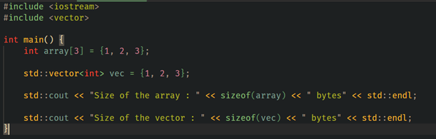

Introduction:

This report examines their memory usage using the __sizeof__() method and provides a comparison with a similar example in another programming language, such as C++.

Experiment in Python:

tpl = (1,2,3)
print('Size of the tuple:',tpl.__sizeof__())

lst = [1,2,3]

print('Size of the list:',lst.__sizeof__())

This is the code. 

Explanation:

tpl = (1, 2, 3):  This defines a tuple containing three integers.
tpl.__sizeof__(): This method returns the memory size (in bytes) of the tuple object itself, excluding the sizes of the elements inside it.
lst = [1, 2, 3]:  This defines a list containing the same three integers.
lst.__sizeof__(): Similar to the tuple, this method returns the memory size (in bytes) of the list object itself.

Output and Analysis

The output may look like this:

Size of the tuple: 48
Size of the list: 72

Tuple (48 bytes): Tuples in Python are immutable and therefore, require a fixed memory allocation, which is generally smaller compared to lists for the same number of elements.

List (72 bytes): Lists are mutable, and Python allocates additional memory to allow for efficient resizing. The extra memory is for list’s ability to dynamically grow, making its memory larger.

Comparison with C++ Implementation:

Explanation of C++ Code

int array[4] = { 1, 2, 3 };
Defines an array of integers with three elements. Arrays in C++ are similar to Python tuples in that they have a fixed size and cannot be dynamically resized.

std::vector<int> vec = {1, 2, 3};
Defines a list of integers with three elements. C++ lists are similar to Python lists as they allow dynamic resizing.

sizeof method: 
This function calculates the memory size of the object.

Output of C++ Result:
Size of the array: 12 bytes
Size of the list:  12 bytes

Array: In C++, array consists of size corresponding to its data type and length. In this example, Length is 3, data-type is integer, so the result is 12 bytes.

List: In C++, list has additional overhead for dynamic resizing and managing its internal structure, so the 12 bytes are just for its internal structure, not with corresponding elements that it contains.

Conclusion

Tuples and Arrays: These are fixed-size and immutable, leading to lower memory usage.
Lists: Both Python and C++ lists have dynamic resizing capabilities, resulting in a higher memory.